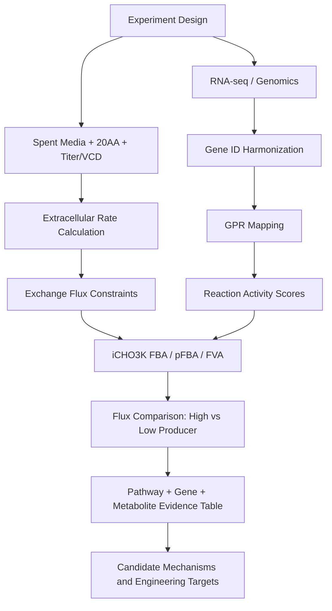

# CHO 항체 생산 metabolomics + transcriptomics/genomics 최적 파이프라인

## 1. 결론부터

항체 고생산 CHO 세포주의 metabolomics 분석은 다음 3층 구조가 가장 실용적입니다.

1. **Spent media / extracellular metabolomics**
   - 배지에서 소비/분비되는 glucose, lactate, ammonia, amino acids를 정량합니다.
   - VCD, viability, titer와 결합해 uptake/secretion rate와 qMet을 계산합니다.

2. **Intracellular / targeted metabolomics**
   - 생산성 차이를 설명하는 central carbon, TCA, redox, nucleotide sugar, energy metabolite를 봅니다.
   - 항체 생산량뿐 아니라 glycosylation quality와 연결할 수 있습니다.

3. **GEM 기반 multi-omics integration**
   - iCHO3K를 기본 모델로 두고, extracellular flux를 exchange constraint로 넣습니다.
   - transcriptomics/genomics는 GPR gene-reaction rule을 통해 reaction activity score 또는 context-specific model 생성에 사용합니다.

## 2. 보통 봐야 하는 대사체 패널

### A. 최소 필수 spent media 패널

| Category | Metabolites | Why |
|---|---|---|
| Carbon source | glucose | 성장/생산의 주 탄소원 |
| Overflow/byproduct | lactate | glycolytic overflow, lactate switch |
| Nitrogen waste | ammonia | glutamine/amino acid catabolism byproduct, viability/product quality risk |
| Glutamine axis | glutamine, glutamate | CHO TCA anaplerosis와 nitrogen metabolism 핵심 |
| Pyruvate/alanine axis | pyruvate, alanine | carbon-nitrogen overflow, transamination |
| Growth/process | VCD, viability, titer | qMet, qP, IVCD 계산에 필수 |

이 정도면 clone screening, high/low producer 비교, lactate/ammonia phenotype 구분은 가능합니다.

### B. 강력 추천: 20 amino acids

외주분석으로 20종 amino acid를 추가하는 것을 추천합니다. 이유는 CHO fed-batch에서 생산성 차이가 단순히 glucose/lactate보다 amino acid uptake pattern과 더 잘 연결되는 경우가 많기 때문입니다.

우선순위가 높은 amino acid:

| Priority | Amino acids | Main interpretation |
|---|---|---|
| Highest | glutamine, glutamate, asparagine, aspartate | TCA anaplerosis, nitrogen balance, Asn/Gln feed design |
| High | serine, glycine, cysteine/cystine, methionine | one-carbon metabolism, glutathione/redox, folding stress |
| High | leucine, isoleucine, valine | BCAA catabolism and growth/productivity state |
| Medium | arginine, lysine, histidine | biomass/protein synthesis, media depletion |
| Medium | phenylalanine, tyrosine, tryptophan | aromatic AA depletion and inhibitory byproducts |
| Medium | proline, threonine, alanine | nitrogen/carbon overflow and protein synthesis |

### C. 생산성과 직접 연결하기 좋은 intracellular/targeted 패널

| Pathway | Metabolites |
|---|---|
| Glycolysis/TCA | glucose-6-phosphate, fructose-6-phosphate, pyruvate, citrate, alpha-ketoglutarate, succinate, fumarate, malate |
| Redox/folding | GSH, GSSG, NADH, NAD+, NADPH, NADP+ |
| Energy | ATP, ADP, AMP, GTP |
| PPP/nucleotide | ribose-5-phosphate, sedoheptulose-7-phosphate, PRPP |
| Glycosylation precursor | UDP-GlcNAc, UDP-Gal, UDP-Glc, GDP-fucose, CMP-sialic acid |
| Lipid/membrane | choline, phosphocholine, carnitine/acylcarnitines |

실제 예산이 제한되면 **spent media + 20AA + ammonia + titer/VCD**를 먼저 하고, 이후 후보 clone에서 intracellular targeted panel을 추가하는 단계적 전략이 좋습니다.

## 3. 최적 모델 선택

### 기본 선택: iCHO3K

iCHO3K는 2026년에 보고된 최신 community-consensus CHO genome-scale metabolic reconstruction입니다. 기존 iCHO1766, iCHO2291, iCHO2048, iCHO2441 계열을 통합/확장한 최신 모델로, multi-omics integration과 flux prediction의 기준 모델로 두는 것이 가장 합리적입니다.

현재 프로젝트 내부에 포함한 실제 모델 파일:

```text
models\iCHO3K\Model\iCHO3K_cho_prod_generic_unblocked.json
```

로컬 inspection 결과:

| Item | Count / ID |
|---|---|
| Reactions | 8,368 |
| Metabolites | 4,695 |
| Genes | 2,929 |
| Exchange-like reactions | 710 |
| Growth objective candidate | biomass_cho_prod |
| Product objective candidate | DM_igg_g |
| IgG assembly reaction | igg_formation |
| Heavy/light chain reactions | igg_hc / igg_lc |

다만 주의할 점:

- iCHO3K는 항체 titer를 바로 맞히는 예측 AI가 아닙니다.
- 입력 데이터인 uptake/secretion rate, growth rate, qP, transcriptomics를 이용해 가능한 intracellular flux 상태를 추정하는 mechanistic model입니다.
- 실제 FBA는 `models\iCHO3K\env\environment.yml` 환경의 COBRApy/GLPK에서 실행하는 것이 좋습니다.

### fallback 모델

iCHO3K 파일을 바로 확보하지 못하면 다음 순서로 갑니다.

1. iCHO3K: 최신/최대 범위 모델
2. iCHO1766: 공개 접근성과 문헌 기반이 가장 넓은 consensus CHO 모델
3. CHO-K1/CHO-S/DG44 context-specific model: 사용 세포주가 명확할 때
4. iCHO2291/iCHO2441/ecCHO 계열: enzyme capacity나 특정 분석 목적이 있을 때

## 4. 전체 파이프라인



## 5. 단계별 설계

### Step 1. 실험 설계

필수 metadata:

- clone_id 또는 passage
- producer_group: high/low, stable/unstable, control/feed
- culture_day
- biological replicate
- VCD, viability
- titer 또는 antibody concentration
- feed event, glucose feed, temperature shift 등 공정 이벤트

### Step 2. extracellular concentration 입력

가능하면 단위는 mM 또는 mg/L로 통일합니다. peak area만 있으면 상대 변화는 가능하지만 qMet이나 GEM constraint에는 부적합합니다.

### Step 3. flux 계산

구간별 apparent rate:

```text
rate = (C_t2 - C_t1) / (t2 - t1)
```

세포수 보정 qMet:

```text
qMet = rate / mean(VCD_t1, VCD_t2)
```

추천 단위:

```text
mmol / 10^6 cells / day
또는
pmol / cell / day
```

### Step 4. iCHO3K exchange reaction mapping

각 대사체를 모델의 extracellular exchange reaction에 연결합니다.

예:

| Metabolite | Model role |
|---|---|
| glucose | glucose uptake exchange |
| lactate | lactate secretion/uptake exchange |
| glutamine | glutamine uptake exchange |
| glutamate | glutamate secretion/uptake exchange |
| ammonia | ammonia secretion exchange |
| amino acids | amino acid uptake constraints |

정확한 reaction ID는 로컬 iCHO3K model file에서 확인했습니다. 주요 ID는 아래와 같습니다.

| Metabolite | iCHO3K exchange reaction |
|---|---|
| glucose | EX_glc_e |
| lactate | EX_lac_L_e |
| ammonia | EX_nh4_e |
| glutamine | EX_gln_L_e |
| glutamate | EX_glu_L_e |
| alanine | EX_ala_L_e |
| asparagine | EX_asn_L_e |
| aspartate | EX_asp_L_e |
| arginine | EX_arg_L_e |
| glycine | EX_gly_e |
| serine | EX_ser_L_e |
| cysteine | EX_cys_L_e |
| methionine | EX_met_L_e |
| leucine | EX_leu_L_e |
| isoleucine | EX_ile_L_e |
| valine | EX_val_L_e |
| lysine | EX_lys_L_e |
| histidine | EX_his_L_e |
| phenylalanine | EX_phe_L_e |
| tyrosine | EX_tyr_L_e |
| tryptophan | EX_trp_L_e |
| proline | EX_pro_L_e |
| threonine | EX_thr_L_e |

### Step 5. transcriptomics/genomics mapping

RNA-seq는 gene-level TPM/count table로 준비합니다.

필수 컬럼:

```text
gene_id
gene_symbol
sample_id
tpm
condition
```

유전체 변이 정보가 있으면 다음처럼 넣습니다.

```text
gene_id
variant_type
copy_number
impact
```

GEM에서는 gene이 reaction과 GPR rule로 연결됩니다.

```text
gene -> enzyme/protein -> reaction -> pathway -> flux
```

그래서 transcriptomics를 flux에 연결하려면 반드시 model의 `reaction_id`, `gpr`, `gene_id`가 필요합니다.

### Step 6. context-specific model 또는 reaction score

초기에는 복잡한 context-specific model보다 reaction activity score를 추천합니다.

간단한 규칙:

- GPR이 OR이면 gene expression 중 max 사용
- GPR이 AND이면 gene expression 중 min 사용
- high producer와 low producer에서 reaction score 차이 계산

이후 충분한 데이터가 쌓이면 GIMME, iMAT, INIT, FASTCORE, RIPTiDe 같은 transcriptomics integration 방법으로 확장합니다.

### Step 7. FBA / pFBA / FVA

권장 순서:

1. extracellular qMet으로 exchange reaction lower/upper bound 설정
2. growth rate를 biomass constraint로 설정
3. antibody secretion 또는 recombinant protein objective를 설정
4. pFBA로 parsimonious flux solution 계산
5. FVA로 불확실한 flux 범위 확인
6. high vs low producer flux difference 계산

### Step 8. multi-omics evidence table

최종 결과는 pathway 단위로 합칩니다.

| Pathway | Metabolite evidence | Flux evidence | Transcript evidence | Interpretation |
|---|---|---|---|---|
| TCA cycle | citrate/malate change | TCA flux up/down | IDH/MDH/CS expression | oxidative metabolism |
| Glutamine metabolism | Gln/Glu/Asn/Asp qMet | anaplerosis flux | GLS/GLUD/GOT/GPT | nitrogen/TCA balance |
| Redox | GSH/NADPH if measured | PPP flux | G6PD/PGD/GSR | folding stress |
| Glycosylation | nucleotide sugars | sugar nucleotide flux | GFPT/GNE/FUT/SLC35 | product quality |

## 6. 추천 figure set

논문에서 가장 무난한 구성:

1. Culture profile
   - VCD, viability, titer, qP
2. Spent media time-course
   - glucose/lactate/glutamine/ammonia
3. 20AA heatmap
   - log2 change or qMet z-score
4. Uptake/secretion rate bar plot
   - high vs low producer qMet
5. PCA/PLS-DA
   - metabolite profile separation
6. Volcano plot
   - metabolite or transcript differential analysis
7. GEM flux map
   - central carbon/TCA/amino acid flux difference
8. Integrated pathway evidence plot
   - metabolite, flux, transcript fold-change를 pathway별로 동시에 표시

## 7. 내가 추천하는 실제 실험 최소안

가장 비용 대비 좋은 설계:

- 3 high producer clone + 3 low producer clone
- day 0/3/5/7/10/14 sampling
- biological replicate 최소 n=3
- 매 time point: VCD, viability, titer
- spent media: glucose, lactate, ammonia, glutamine, glutamate
- 외주: 20 amino acids
- RNA-seq: day 3 또는 exponential phase, day 7 또는 production phase
- 선택: intracellular targeted metabolites는 후보 clone 2-3개에서만 수행

이 설계면 iCHO3K 기반 flux constraint와 transcriptomics integration까지 가능합니다.
